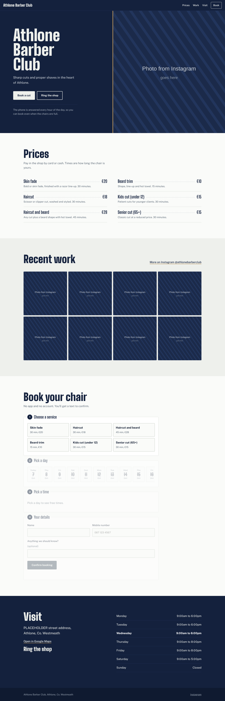

# Athlone Barber Club

Website, online booking and a 24/7 AI phone receptionist for Athlone Barber Club, all in one small Node app with no booking-platform fees.

- **Website** (`public/`): prices, Instagram photos, opening hours, and a four-step booking form.
- **Booking diary** (`src/bookings.js`, `src/store.js`): one source of truth for free times, used by the website, the phone and the owner. Stored in `data/bookings.json`.
- **Owner's diary** (`/admin`): see upcoming bookings, cancel, block out lunch or days off, read phone messages.
- **AI phone receptionist** (`src/agent.js`): Twilio answers the call and turns speech into text (ConversationRelay); Claude talks to the caller and uses the diary through tools to check times, book, find and cancel the caller's own bookings, take messages, or put the caller through to the owner. Customers and the owner get a text for each booking.



## How a call flows

1. A customer rings the shop's Twilio number (or the owner's own number forwards unanswered calls to it).
2. Optional: the owner's mobile rings first for `RING_OWNER_FIRST_SECONDS`. If he answers, that's it.
3. Otherwise the AI picks up, says it's the shop's AI assistant, and handles the booking.
4. If the caller wants a person or has a complaint, the AI transfers to the owner's mobile, or takes a message that's texted to him and saved in `/admin`.

## Run it locally

```bash
npm install
cp .env.example .env   # fill in what you have; the site and booking work without Twilio or Claude
npm start              # http://localhost:3000, diary at http://localhost:3000/admin
npm test               # 19 tests: diary rules, phone agent with a scripted model, webhooks
```

## Change prices, hours or barbers

Edit `config/shop.json`. Everything (site, booking form, phone agent) reads from it; no restart needed. Add more barbers to the `barbers` list and the site shows a barber choice automatically.

## Photos

Instagram blocks automatic downloads, so save the photos by hand and drop them in `public/images/gallery/` as `1.jpg` to `8.jpg`. `1.jpg` is also the big hero photo. Until then a striped placeholder shows.

## Deploy

Any host that runs Node 20+, keeps a persistent disk and allows WebSockets works. `render.yaml` sets it up on Render with a disk for the diary. After it's live, point the Twilio number's "A call comes in" webhook to `https://YOUR-DOMAIN/voice/incoming` (HTTP POST). See `OWNER-SETUP.md` for the full checklist.

## Security notes

- Twilio webhooks and the call WebSocket check Twilio's signature; set `TWILIO_VALIDATE_SIGNATURES=false` only for local testing.
- The phone agent can only look up or cancel bookings made under the number the caller is ringing from.
- `/admin` is protected by `ADMIN_PASSWORD`. Use a long one.
- Bookings hold names and phone numbers, so add a line to the site's privacy notice and keep the host's region in the EU if you can.
